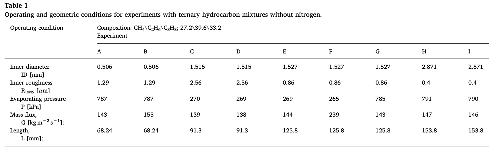
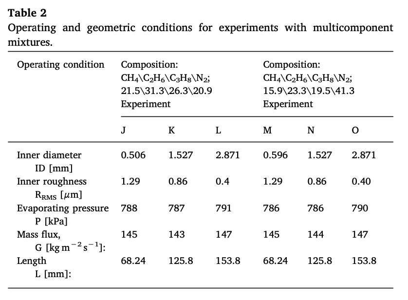
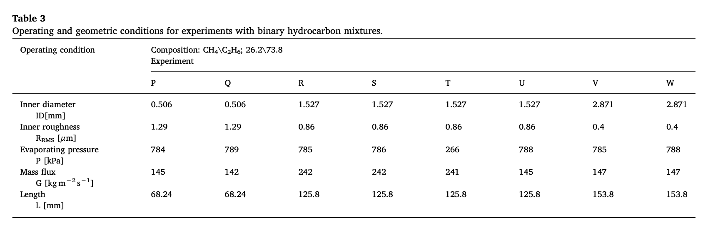
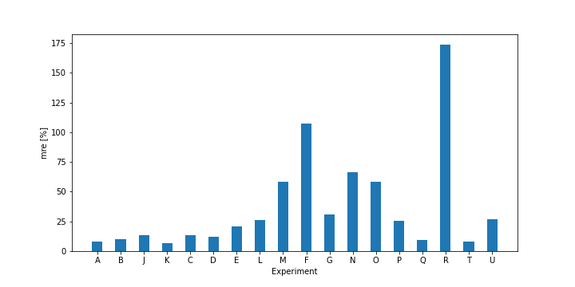

# Quantum Neural Network-based correlation for frictional pressure drop of of non-azeotropic mixtures during cryogenic forced boiling

This work proposes a Quantum neural network-based methodology to estimate frictional pressure drop during boiling in mini-channels of non-azeotropic mixtures including nitrogen, methane, ethane, and propane. The methodology can assist in thermal analysis or design of heat exchangers used in cryogenic applications. The architecture of the proposed model includes the local quality, roughness, mass flux, and Reynolds number as inputs and frictional pressure drop as outputs.
It will compare with one paper where my colleagues and I use the same data to create an ANN-based correlation for pressure drop estimation in microchannels [1].

[1] Barroso-Maldonado, J. M., Montañez-Barrera, J. A., Belman-Flores, J. M., and Aceves, S. M. (2019). ANN-based correlation for frictional pressure drop of non-azeotropic mixtures during cryogenic forced boiling. Applied Thermal Engineering, 149(August 2018), 492-501. https://doi.org/10.1016/j.applthermaleng.2018.12.082
### Experimental Data
The data of this project was obtained from Barraza et. al [2]. The input variables were choose based on the input used for the correlations which are the local quality, roughness, mass flux, and Reynolds number. The following tables show the conditions for each experiment.

[2] R.Barraza,G.Nellis,S.Klein,D.Reindl,Measuredandpredictedfrictionalpressure drop for boiling zeotropic mixed refrigerants in horizontal tubes, Int. J. Heat Mass Transf. 98 (2016) 285–298, https://doi.org/10.1016/j.ijheatmasstransfer.2016.03.010.
## QNN Architecture
After trying with different configurations for the QNN, the architecture that best fit the experimental data was one that used strongly entangling layers of size (3,4,3) and the input parameters before each of these layers. 

## Training
For the training, I used mini-batches and my cost function is just the difference between the squared value of my output and the target output. The optimizer with better performance was the AdamOptimizer.
## Results 
The Figure below shows the mean relative error (mre) for the different experiments. The minimum error I got was for experiment K with mre = 6.8% and a similar error for the other experiments in Table 1 (with exception of experiment F). For the other experiments, I got a high mre, this can be atributed to the fact that I do not have enough data for these cases.

The Figure below shows the result of the QNN-based correlation for frictional pressure drop of the non-azeotropic mixtures, here the x-axis is the quality of the mixture and the y-axis is the frictional pressure drop. 

## Conclusions
The proposed model uses a set of experimental parameters as input variables: local quality (0–1), surface roughness (0.4–2.6 mm), mass flux (139–242 kgm−2 s−1), and Reynolds number (197–50,740). Based on mre for different architectures we chosse the QNN model. This model uses 3 StronglyEntanglingLayers and in between these layers RX rotation to encode the inputs. Using the mean relative error, it is demonstrated that the proposed QNN-based model does not give the expected result with a mean relative error mre = 37.5%. If compared with the best available correlations produce mean relative errors mre = 23.9% (Sun and Mishima), mre = 24.1% (Awad and Muzychka), mre = 25.3%, (Cicchitti et al.), and the ANN in [1] has mre = 8.3%.

I have two times more parameters in my QNN than those we used in the ANN [1]. Then, I do not think the problem is in the number of parameters used. Therefore, I have to change the architecture of the QNN and the way I encode the input data to get a better fit for the experimental results. 
